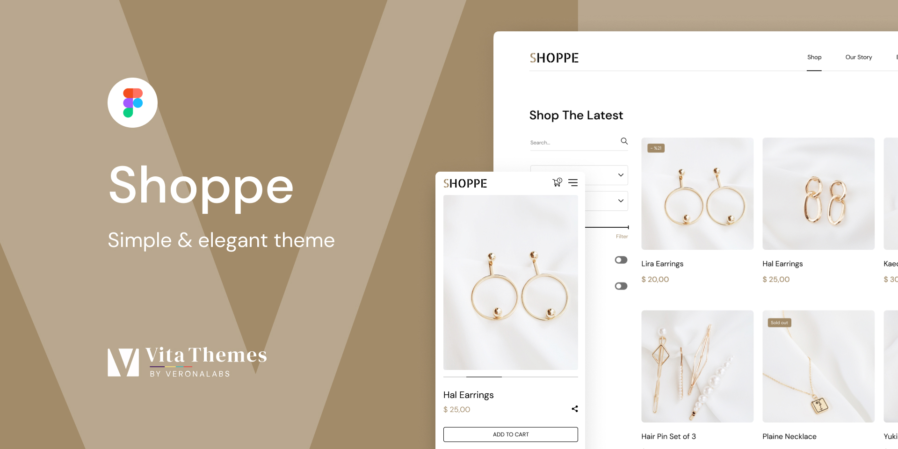

# Командний проект **Shoppe Store** | Vanilla JS

Читати іншою мовою [**Англійська**](https://github.com/San88Francisco/ShoppeStore/blob/main/README.md 'Перейти до англійського перекладу')  
Читати іншою мовою [**Польська**](https://github.com/San88Francisco/ShoppeStore/blob/main/README.pl.md 'Перейти до польського перекладу')

&nbsp;

# Посилання на проект [**ShoppeStore.com.ua**](https://shoppestore.netlify.app 'Перейти на сайт проекту')

&nbsp;

## Команда проекту

&nbsp;

| УЧАСНИК                                                                                                            | РОЛІ                                                                |
| ------------------------------------------------------------------------------------------------------------------ | ------------------------------------------------------------------- |
| <span style="font-size:20px">[**Vasyl Verbytskyi**](https://github.com/San88Francisco 'Перейти на Git Hub')</span> | <span style="font-size:20px">**Lead Software Developer**</span>     |
| <span style="font-size:20px">[**Roman Vasylenko**](https://github.com/Akumuuu 'Перейти на Git Hub')</span>         | <span style="font-size:20px">**Lead Software Developer**</span>     |
| <span style="font-size:20px">[**Ivan Yakovchuk**](https://github.com/YakovchukIvan 'Перейти на Git Hub')</span>    | <span style="font-size:20px">**Frontend Software Developer**</span> |
| <span style="font-size:20px">[**Danylo Hlusov**](https://github.com/Xlussov 'Перейти на Git Hub')</span>           | <span style="font-size:20px">**Frontend Software Developer**</span> |
| <span style="font-size:20px">[**Andrii Dmytruk**](https://github.com/admitruk237 'Перейти на Git Hub')</span>      | <span style="font-size:20px">**Frontend Software Developer**</span> |
| <span style="font-size:20px">[**Andrij Potapov**](https://github.com/AndrijPot 'Перейти на Git Hub')</span>        | <span style="font-size:20px">**Frontend Software Developer**</span> |
| <span style="font-size:20px">[**Denys Levchenko**](https://github.com/gitdenlev 'Перейти на Git Hub')</span>       | <span style="font-size:20px">**Frontend Software Developer**</span> |
| <span style="font-size:20px">[**Denys Tkachenko**](https://github.com/Tkachenko01001 'Перейти на Git Hub')</span>  | <span style="font-size:20px">**Frontend Software Developer**</span> |
| <span style="font-size:20px">[**Volodymyr Kirilyuk**](https://github.com/ZD-Donatik 'Перейти на Git Hub')</span>   | <span style="font-size:20px">**Frontend Software Developer**</span> |

&nbsp;

## Посилання на макет у Figma

[](<https://www.figma.com/file/yYKzT2pnaAR7UVJQKVhGJz/Shoppe-(Community)-(Copy)?type=design&node-id=1908-2067&mode=design&t=uM9WecxIjNGtVyRj-0> 'Перейти на проект')

&nbsp;

## Про проект

&nbsp;

### [**Shoppe Store**](https://gleeful-faloodeh-752787.netlify.app/ 'Перейти на сайт проекту') є благодійним проектом, де застосовувалися виключно стандарті технології по розробці сайтів,а саме - <u>**HTML**</u>, <u>**CSS**</u> та <u>**JAVASCRIPT**</u>.

### Особливості

<ol style='font-size:18px; font-weight: 500'>
    <li><span style="font-size:18px"><b>Співпраця:</b></span>
        <ul>
            <li style="font-size:16px">Щоденні мітинги для обговорення завдань.</li>
            <li style="font-size:16px">Використання Trello для організації завдань.</li>
        </ul>
    </li>
    <li><span style="font-size:18px">Розподіл завдань:</span>
        <ul>
            <li style="font-size:16px">Завдання розподілялися за складністю.</li>
            <li style="font-size:16px">Більше людей залучалися до складніших задач.</li>
        </ul>
    </li>
    <li><span style="font-size:18px">Чистий код:</span>
        <ul>
            <li style="font-size:16px; text-decoration: underline">Весь проект написаний без використання бібліотек та фреймворків (за винятком SASS).</li>
        </ul>
    </li>
    <li><span style="font-size:18px">Огляд коду:</span>
        <ul>
            <li style="font-size:16px">Кожна нова задача давалася на окремій сторінці.</li>
            <li style="font-size:16px">Учасники команди мали можливість працювати з чужим кодом та вдосконалювати свої навички рецензування.</li>
        </ul>
    </li>
    <li><span style="font-size:18px">Github:</span>
        <ul>
            <li style="font-size:16px">Розробка та контроль проекту здійснювалися в Github.</li>
            <li style="font-size:16px">Для кожного завдання використовувалась окрема гілка.</li>
            <li style="font-size:16px">Тімліди регулярно перевіряли код та об'єднували гілки.</li>
            <li style="font-size:16px">Тімліди навчили учасників команди оновлювати свої гілки з main перед внесенням змін.</li>
        </ul>
    </li>
</ol>

## Цінність проекту:

### Головною метою було вдосконалення навичок в сфері розробки багатофункціональних сайтів на чистому JavaScript.

### Цей проект є чудовим прикладом командної роботи, навичок кодування та здатності до навчання. Він став цінним доповненням для кожного хто над ним працював.

### <u>**Весь функціонал сайту виконано без використанні будь-яких бібліотек чи фреймворків.**</u> Єдине що було підключено, так це препроцесор SASS.

### Використовувалася власна збірка, яка обєднує Webpack та Gulp, для кращого розуміння різних видів збірок.

#### Для початку роботи потрібно встановити пакети модулів :

```
npm install
```

#### Далі запускаємо проект :

```
npm run dev
```

## &nbsp;


&nbsp;

&nbsp;

# Дякуємо за ваш час!
